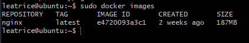
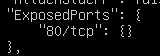
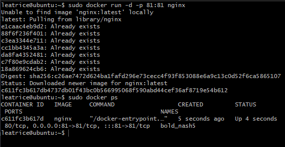
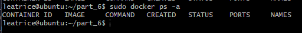

# SimpleDocker

## Part 1. Готовый докер

1. Возьмём официальный докер-образ с nginx и выкачай его при помощи `docker pull`.


2. Проверь наличие докер-образа через `docker images`.



3. Запусти докер-образ через `docker run -d [image_id|repository]`.


Флаг -d в команде docker run используется для запуска контейнера в фоновом режиме (detached mode). Это означает, что контейнер будет запущен в фоновом процессе, и вы сможете продолжить работу с командной строкой без блокировки ее выполнения.

4. Проверь, что образ запустился через `docker ps`.


5. Посмотри информацию о контейнере через `docker inspect [container_id|container_name]`.


6. По выводу команды определи и помести в отчёт размер контейнера, список замапленных портов и ip контейнера.

- Размер контейнера:


- Список замапленных портов:



Замапленные порты (mapped ports) в контексте Docker означают связывание портов контейнера с портами на хостовой машине.

- IP контейнера


7. Останови докер образ через `docker stop [container_id|container_name]`.


8. Проверь, что образ остановился через `docker ps`.


9. Запусти докер с портами 80 и 443 в контейнере, замапленными на такие же порты на локальной машине, через команду `run`.


`sudo docker run -d -p 80:80 -p 443:443 nginx` 

используется для запуска контейнера с образом Nginx в фоновом режиме, а также для привязки портов 80 и 443 контейнера к соответствующим портам на хостовой машине.
-d означает запуск контейнера в фоновом режиме (detached mode).
-p 80:80 привязывает порт 80 контейнера к порту 80 на хостовой машине. Это позволяет получить доступ к веб-серверу Nginx, работающему внутри контейнера, через порт 80 на хостовой машине.
-p 443:443 привязывает порт 443 контейнера к порту 443 на хостовой машине. Это позволяет получить доступ к защищенному соединению (HTTPS) через порт 443 на хостовой машине.

10. Проверь, что в браузере по адресу localhost:80 доступна стартовая страница nginx.


Перебросил порты с виртуалки на основную машину, потому что выполняю проект на серверном линуксе

11. Перезапусти докер контейнер через `docker restart [container_id|container_name]`.


12. Проверь любым способом, что контейнер запустился.

`docker ps`


## Part 2. Операции с контейнерами

1. Прочитай конфигурационный файл `nginx.conf` внутри докер контейнера через команду exec.

`sudo docker exec sharp_boyd cat /etc/nginx/nginx.conf`


2. Создай на локальной машине файл `nginx.conf`.

3. Настрой в нем по пути /status отдачу страницы статуса сервера nginx.


4. Скопируй созданный файл `nginx.conf` внутрь докер-образа через команду `docker cp`.


5. Перезапусти nginx внутри докер-образа через команду `exec`.

`sudo docker exec sharp_boyd nginx -s reload`


Флаг -s используется для отправки сигнала веб-серверу Nginx. 

6. Проверь, что по адресу `localhost:80/status` отдается страничка со статусом сервера nginx.


7. Экспортируй контейнер в файл `container.tar` через команду export.


8. Останови контейнер.

`sudo docker stop sharp_boyd`


9. Удали образ через `docker rmi [image_id|repository]`, не удаляя перед этим контейнеры.


- флаг -f (или --force), принудительно удаляет образ, даже если он используется или связан с другими контейнерами. 

10. Удали остановленный контейнер.


11. Импортируй контейнер обратно через команду `import`.

`sudo docker import -c 'cmd ["nginx" , "-g", "daemon off;"]' -c 'ENTRYPOINT ["/docker-entrypoint.sh"]' container.tar part_2`


- флаг -c используются для указания команд и параметров конфигурации контейнера при его создании. В данном случае, мы указываем команду cmd ["nginx" , "-g", "daemon off;"] и точку входа ENTRYPOINT ["/docker-entrypoint.sh"].

- 'cmd ["nginx" , "-g", "daemon off;"]' указывает команду, которую Docker будет выполнять при запуске контейнера. В данном случае, команда nginx -g 'daemon off;' запускает веб-сервер Nginx и передает ему параметр -g 'daemon off;', который указывает Nginx работать в переднем плане (не в фоновом режиме) и не выводить дополнительную информацию в журнале.

- 'ENTRYPOINT ["/docker-entrypoint.sh"]' задает точку входа (entrypoint) для контейнера. Точка входа определяет исполняемый файл, который будет запущен при запуске контейнера. В данном случае, точка входа указывает на скрипт /docker-entrypoint.sh, который будет запущен при запуске контейнера.

12. Запусти импортированный контейнер.


13. Проверь, что по адресу `localhost:80/status` отдается страничка со статусом сервера `nginx`.


## Part 3. Мини веб-сервис

1. Напиши мини-сервер на C и FastCgi, который будет возвращать простейшую страничку с надписью Hello World!.

Для этого установим FastCgi и gcc для компиляции

spawn-fcgi и FastCGI (Fast Common Gateway Interface) - это инструменты для работы с FastCGI протоколом.

FastCGI является протоколом взаимодействия между веб-сервером и внешним процессом, обрабатывающим динамические запросы. Он позволяет эффективно обрабатывать динамические запросы, уменьшая накладные расходы на создание и завершение процессов для каждого запроса.

spawn-fcgi - это утилита командной строки, которая создает FastCGI процесс, связывается с веб-сервером и управляет запуском и остановкой внешнего процесса, обрабатывающего запросы.

libfcgi-dev - это пакет разработчика для FastCGI библиотеки libfcgi. Он содержит заголовочные файлы и статическую библиотеку, необходимые для разработки FastCGI приложений на C.

```
sudo apt-get install libfcgi-dev
sudo apt-get install gcc
```


2. Запусти написанный мини-сервер через spawn-fcgi на порту 8080.

Установим spawn-fcgi

`sudo apt-get install spawn-fcgi`

Компилируем и запускаем сервер


3. Напиши свой nginx.conf, который будет проксировать все запросы с 81 порта на 127.0.0.1:8080.


4. Проверь, что в браузере по localhost:81 отдается написанная тобой страничка.

Нужно отослать файл с конфигурацией и исполняемый файл в контейнер, а потом запустить контейнер

- Запускаем контейнер nginx



- Экспортируем все нужные файлы


- Устанавливаем на сам контейнер spawn-fcgi libfcgi-dev

```
sudo docker exec bold_nash5 apt-get update
sudo docker exec bold_nash5 apt-get install -y gcc spawn-fcgi libfcgi-dev
```

Флаг -y в команде apt-get install означает автоматическое подтверждение (yes) для всех вопросов, которые могут возникнуть во время установки пакетов.


- Запускаем spawn-fcgi и перезапускаем контейнер


- Проверяем веб-браузер 


## Part 4. Свой докер

1. Напиши свой докер-образ, который:

1) собирает исходники мини сервера на FastCgi из Части 3;

2) запускает его на 8080 порту;

3) копирует внутрь образа написанный ./nginx/nginx.conf;

4) запускает nginx.


2. Собери написанный докер-образ через docker build при этом указав имя и тег.


3. Проверь через docker images, что все собралось корректно.


4. Запусти собранный докер-образ с маппингом 81 порта на 80 на локальной машине и маппингом папки ./nginx внутрь контейнера по адресу, где лежат конфигурационные файлы nginx'а (см. Часть 2).


5. Допиши в ./nginx/nginx.conf проксирование странички /status, по которой надо отдавать статус сервера nginx.


6. Проверь, что теперь по localhost:80/status отдается страничка со статусом nginx


## Part 5. Dockle.

Dockle - это инструмент статического анализа безопасности для контейнеров Docker. Он предназначен для проверки контейнеров на соответствие рекомендациям безопасности и наличие потенциальных уязвимостей

1. Просканируй образ из предыдущего задания через `dockle [image_id|repository]`.


- CIS-DI-0010: Не сохранять учетные данные в переменных окружения/файлах.

- DKL-DI-0005: Очистка кэш apt-get.

- CIS-DI-0001: Создать пользователя для контейнера.

- DKL-DI-0006: Избегать использования тега latest.

- CIS-DI-0005: Включить доверие к контенту Docker.

- CIS-DI-0006: Добавьть инструкцию HEALTHCHECK в образ контейнера.

- CIS-DI-0008: Подтвердить безопасность файлов setuid/setgid.


2. Исправь образ так, чтобы при проверке через dockle не было ошибок и предупреждений.

Подробно про Dockerfile

Файл начинается с указания базового образа FROM nginx:latest, что означает использование последней версии образа nginx в качестве основы для создания нового образа.

Затем мы переключаемся в режим пользователя root с помощью команды `USER root`. Это нужно для выполнения некоторых операций с привилегиями суперпользователя.

Далее, с помощью команды `COPY` копируются файлы `nginx/nginx.conf` и `mini_server.c` внутрь образа. Файл `nginx/nginx.conf` будет скопирован в путь `/etc/nginx/nginx.conf` внутри контейнера, а файл `mini_server.c` - в корневой каталог контейнера.

Права доступа и пользователи внутри контейнера

`chown -R nginx:nginx /etc/nginx/nginx.conf`
Эта команда изменяет владельца и группу файла `/etc/nginx/nginx.conf` на `nginx`. Опция `-R` указывает на рекурсивное изменение владельца и группы для всех файлов и директорий внутри `/etc/nginx/nginx.conf`.

`chown -R nginx:nginx /var/cache/nginx`
`chown -R nginx:nginx /home`

Аналогично предыдущей команде, эти две команды изменяют владельца и группу для директорий `/var/cache/nginx` и `/home на nginx`.

`touch /var/run/nginx.pid`
`chown -R nginx:nginx /var/run/nginx.pid`

Команда touch создает пустой файл `/var/run/nginx.pid`, а затем команда chown изменяет владельца и группу этого файла на nginx.

```
chmod u-s /usr/bin/newgrp;
chmod u-s /bin/umount;
chmod u-s /bin/mount;
chmod u-s /usr/bin/chsh;
chmod 755 /usr/bin/passwd;
chmod u-s /bin/su;
chmod u-s /usr/bin/gpasswd;
chmod u-s /usr/bin/chfn;
chmod 255 /usr/bin/wall;
chmod 255 /usr/bin/chage;
chmod 255 /usr/bin/expiry;
chmod 255 /sbin/unix_chkpwd
```
Все эти команды изменяют разрешения доступа (права) для указанных исполняемых файлов. Например, команда `chmod 755 /usr/bin/passwd ` устанавливает права `755 (rwxr-xr-x)` для файла `/usr/bin/passwd`. Опция `u-s` удаляет setuid-бит, который позволяет исполнять файл с привилегиями владельца.

`useradd nginx`

Команда useradd создает нового пользователя с именем nginx внутри контейнера.

`rm -rf /var/lib/apt/lists/*`

Эта команда удаляет содержимое директории `/var/lib/apt/lists/`. Эта директория используется для хранения списков пакетов, полученных из удаленных репозиториев при выполнении команды `apt-get update`. Удаление содержимого этой директории позволяет сократить размер образа Docker.

После этого добавляется инструкция HEALTHCHECK, которая будет проверять доступность контейнера каждые 5 минут, отправляя HTTP-запрос на `http://localhost/`. Если запрос не успешен, контейнер будет считаться недоступным.

В конце Dockerfile, команда `USER nginx` переключает пользователя на nginx, чтобы запустить Nginx с этим пользователем.


## Part 6. 

1. Напиши файл docker-compose.yml, с помощью которого:

1) Подними докер-контейнер из Части 5 (он должен работать в локальной сети, т.е. не нужно использовать инструкцию EXPOSE и мапить порты на локальную машину).

2) Подними докер-контейнер с nginx, который будет проксировать все запросы с 8080 порта на 81 порт первого контейнера.

Сервис "server" настроен следующим образом:

Используется образ с именем "leatrice:v1", который будет создан из Dockerfile, расположенного в текущей директории (build: .).
Название контейнера устанавливается на "container_1".
В этом сервисе не указаны порты или тома.
Сервис "proxy" настроен следующим образом:

Используется официальный образ Nginx.
Название контейнера устанавливается на "container_2".
Внутри контейнера монтируется файл конфигурации Nginx из локальной директории "./nginx/nginx.conf" в путь "/etc/nginx/nginx.conf".
Порт 80 контейнера проксируется на порт 8080 хоста.

Таким образом, при запуске команды docker-compose up, будет создано два контейнера - один с именем "container_1" на основе образа "leatrice:t1", и второй с именем "container_2" на основе образа Nginx. Контейнер "container_2" будет проксировать запросы с порта 80 хоста на порт 8080 контейнера "container_1". Файл конфигурации Nginx, указанный в volumes, будет использоваться для настройки прокси-сервера.


2. Замапь 8080 порт второго контейнера на 80 порт локальной машины.


3. Останови все запущенные контейнеры.



4. Собери и запусти проект с помощью команд docker-compose build и docker-compose up.


5. Проверь, что в браузере по localhost:80 отдается написанная тобой страничка, как и ранее.


